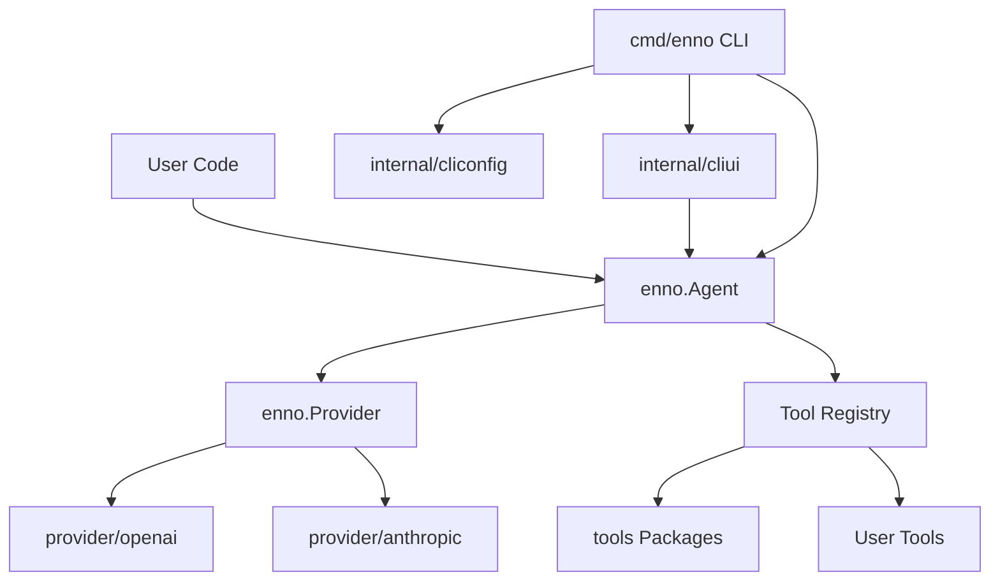

# Enno Agent Framework Design

## 目标

Enno 的目标是提供一个可被 Go 项目直接引入的通用 Agent 框架，同时交付一个可安装使用的 CLI Agent。框架核心只负责 Agent 循环、消息历史、工具调用和模型供应商抽象；具体模型 SDK、内置工具和 CLI 配置都放在独立包中。

设计重点：

- 根包 `enno` 提供稳定公共 API，不暴露 OpenAI 或 Anthropic SDK 类型。
- provider 以插件形式接入，新增模型供应商不需要改 Agent loop。
- tools 以可选包形式组合，用户可以只使用框架核心，也可以引入内置文件、shell、todo 工具。
- CLI 复用库能力，只负责读取参数、组装 provider/tools、启动内部 UI 或执行一次 `Agent.Run`。

## 目录结构

```text
enno/
  agent.go
  config.go
  errors.go
  message.go
  provider_iface.go
  tool.go

  provider/
    provider.go
    openai/
      openai.go
    anthropic/
      anthropic.go

  tools/
    todo/
      todo.go
    filesystem/
      filesystem.go
    shell/
      shell.go

  internal/
    cliconfig/
      config.go
    cliui/
      repl.go

  cmd/
    enno/
      main.go

  examples/
```

## 核心包职责

### 根包 `enno`

根包是用户最常接触的 API 面：

- `Agent`：维护对话历史、执行 Agent loop、分发工具调用。
- `Config`：注入 provider、system prompt、tools、最大工具轮数。
- `Provider`：模型供应商统一接口。
- `Request` / `Response`：Agent 与 provider 之间的统一协议。
- `Message` / `ToolCall`：跨 provider 的统一消息和工具调用结构。
- `Tool`：工具声明和本地执行 handler 的统一表示。

根包不读取环境变量，也不导入具体 provider SDK。这样它可以在服务端、测试、嵌入式场景中稳定复用。

Agent 支持可选事件回调，用于观察模型调用、工具调用、工具结果和 token usage。事件只包含可观测执行过程和模型显式返回内容，不包含隐藏 chain-of-thought。

### `provider/*`

provider 子包负责把 `enno.Request` 翻译成具体模型 SDK 请求，并把响应翻译回 `enno.Response`。

- `provider/openai`：OpenAI Chat Completions 兼容实现，支持 OpenAI 兼容网关。
- `provider/anthropic`：Anthropic Messages API 实现，支持 `tool_use` 和 `tool_result`。
- `provider/provider.go`：提供 `enno.Provider` 等类型别名，方便用户按 provider 目录理解接口。

新增 provider 时，应实现：

```go
type Provider struct {
    // SDK client and config
}

func (p *Provider) Complete(ctx context.Context, req enno.Request) (enno.Response, error)
```

### `tools/*`

内置工具是普通的 `enno.Tool`，不享有特殊权限：

- `tools/todo`：提供 `todo` 工具，每次 `todo.New()` 都拥有独立状态。
- `tools/filesystem`：提供 `read_file`、`write_file`、`edit_file`，通过 `Config.Root` 限制文件访问范围。
- `tools/shell`：提供 `bash`，通过 `Config.Workdir`、`Config.Timeout`、`Config.DenyList` 控制执行环境。
- `tools/compact`：仅注册名为 `compact` 的工具元数据；**实际压缩逻辑在根包 `Agent` 内**（`compaction_impl.go`），避免 handler 无法访问历史记录，并与 **`Config.Compaction`** 联动。

内置工具不默认注入根包 `Agent`，调用方需要显式选择。

### `internal/cliui`

`internal/cliui` 是 CLI 专用的终端 UI 层，负责 `cmd/enno` 基于 `tview` 的交互式 TUI 和非终端 fallback。它消费 Agent 事件来展示运行状态、工具轨迹和上下文使用情况。

它不是公共 SDK API。SDK 用户应直接调用 `Agent.Run(ctx, input)`，并在自己的 HTTP、Bot、桌面端或终端应用中自行组织交互层。

### `cmd/enno`

CLI 是正式交付物，但保持薄封装：

- 读取 CLI flags 和 `config.yaml`。
- 构造 provider。
- 注册默认工具。
- `run` 模式直接调用 `Agent.Run`。
- 交互模式调用 `internal/cliui`。

CLI 专用配置逻辑放在 `internal/cliconfig`，避免污染库包。

## 数据流



## Agent Loop

`Agent.Run(ctx, input)` 的流程：

1. 将用户输入追加到 `Agent` 的历史消息。
2. 调用 `Provider.Complete`，传入 system prompt、历史和工具定义。
3. 如果 provider 返回普通文本，追加 assistant message 并返回文本。
4. 如果 provider 返回 tool calls，逐个查找本地工具并执行。
5. 将工具结果追加为 tool message，继续下一轮模型调用。
6. 达到 `MaxToolRounds` 后返回错误，防止无限工具循环。

仅当 `Config.Tools` 中注册了名为 `todo` 的工具时，`Agent` 才会在多轮工具执行后跟踪「距离上次调用 todo 的轮数」：连续 **3** 轮模型回合里都执行了工具但未调用 `todo` 时，会在历史中追加一条内容为 `<reminder>Update your todos.</reminder>` 的用户消息，促使模型更新任务列表。未挂载 `todo` 工具时不会注入该提醒。

`Agent` 内部持有互斥锁，同一个实例的 `Run` 调用会串行执行。需要并发会话时，应创建多个 `Agent` 实例。

### 上下文压缩（Compaction）

可选 `Config.Compaction`（`nil` 或 `Enabled: false` 为关闭；**默认关闭**）在每一轮模型调用**之前**对 `[]Message` 做处理：

1. **Micro**：将较早的 `RoleTool` 长内容替换为 `[Previous: used <tool>]` 占位，保留最近 N 条**符合条件**的 tool 结果全文；工具名由向前扫描最近一条 `RoleAssistant` 的 `ToolCalls` 匹配 `ToolCallID`。若配置了 `MicroCompactToolNames`（非空），仅对这些工具名的 tool 消息参与「保留最近 N 条 / 更早占位」；其它工具结果始终保留全文。
2. **Auto**：用「字符估算的 `EstimateUsage`」与「上一轮 `Complete` 返回的 `Usage.InputTokens`（若有）」取较大值，作为保守输入规模；与**有效阈值**比较。阈值优先级：`ModelContextTokens > 0` 时用 `ModelContextTokens - AutoCompactBufferTokens`（buffer 默认 13000）；否则用 `AutoCompactInputTokens`（默认 50000）。达到阈值则把当前历史写入 `TranscriptDir` 下的 `transcript_<unix>.jsonl`，再调用模型摘要；摘要提示要求 `<analysis>` + `<summary>`，`FormatCompactSummary` 会去掉 analysis 并抽取 summary。摘要失败时可配置「仅自动路径」`SkipOnSummarizeError`：发错误事件但不替换历史；并支持一次「仅用后半段消息」的重试。同一 `Run()` 内连续摘要失败达到上限则本趟不再尝试自动压缩。
3. **Manual**：模型在同一条 assistant 消息中**仅**调用 `compact` 工具时，弹出该条 assistant，对「弹出前的历史 + 被弹出的 assistant」做与 Auto 相同的存档与摘要；摘要失败时仍**中止并返回错误**（与自动路径的 skip 策略无关）。成功后同样收起为单条 `[Compressed]` 用户消息；**不**为本次 compact 追加 `ToolMessage`。

手动与自动路径都会**额外计费**；启用时会在磁盘写入 transcript。实现放在根包 `compaction_impl.go`（避免与根包导入循环）。

### Subagent（`task` 工具）

可选包 [`tools/subagent`](../tools/subagent/) 提供名为 `task` 的工具：父 `Agent` 在持有完整工具列表（含 `task`）的前提下，每次调用 `task` 会**新建**一个子 `Agent`，子 Agent 使用**空历史**、子专用 system prompt，以及**不含 `task` 的工具集**（与父共享同一 `Provider`）。子 Agent 跑完 `Agent.Run` 后，仅将其最终文本回复（经长度截断）作为本次 `task` 的工具结果写回父对话；子会话中的中间消息全部丢弃，从而实现与父上下文的隔离。子工具列表中若再次包含 `task` 会在构造时报错，避免递归委派。

CLI 默认不启用 `task`；在 `config.yaml` 中设置 `subagent: true` 或使用相应逻辑开启后，才会装配该工具。

### Skills（`load_skill` 与 `SKILL.md`）

可选包 [`tools/loadskill`](../tools/loadskill/) 在指定根目录下**递归**查找 `SKILL.md`：每个文件使用 YAML frontmatter（`name`、`description`）与正文；`name` 缺省时用该文件**所在目录名**。

- **第一层（低成本）**：在 system prompt 尾部追加 `Skills available:` 与每行 `  - name: description` 摘要。
- **第二层（按需）**：`load_skill` 工具接受参数 `name`，在 **tool result** 中返回 `<skill name="...">` 包裹的完整正文；未知名称则返回 `Error: Unknown skill '...'.` 风格提示。

若目录中未找到任何可解析的 skill，不注册 `load_skill`，也不追加摘要。子 Agent（若启用 `task`）会获得与父级相同的 `load_skill` 工具与技能目录扫描结果。磁盘读取与解析仅发生在 CLI / 应用装配侧，不进入根 `enno` 包。

CLI 会**默认**把 `~/.enno/skills` 作为第一个技能根目录（不存在则跳过），再通过 `config.yaml` 的 `skills_extra_dirs` 与（可选）`skills_dir`、以及 `--skills-dir` **按顺序合并**；多个目录下出现同名 skill 时，**后序目录覆盖先序**。

## 扩展点

### 自定义工具

使用 `enno.NewTool` 可以直接接收原始 JSON 参数；使用 `enno.NewTypedTool[T]` 可以让框架完成 JSON 解析：

```go
type Input struct {
    Name string `json:"name"`
}

tool := enno.NewTypedTool("greet", "Greet a person.", schema, []string{"name"},
    func(ctx context.Context, input Input) (string, error) {
        return "Hello, " + input.Name, nil
    },
)
```

### 自定义 Provider

只要实现 `enno.Provider` 即可接入任意模型后端：

```go
type MyProvider struct{}

func (p *MyProvider) Complete(ctx context.Context, req enno.Request) (enno.Response, error) {
    // Convert req to your model API, then return enno.Response.
}
```

## 设计约束

- 根包不得导入具体模型 SDK。
- CLI 不得实现独立 Agent loop。
- 内置工具不得依赖全局状态。
- 文件和 shell 工具必须显式配置工作目录或根目录。
- provider adapter 只做协议转换，不执行本地工具。
