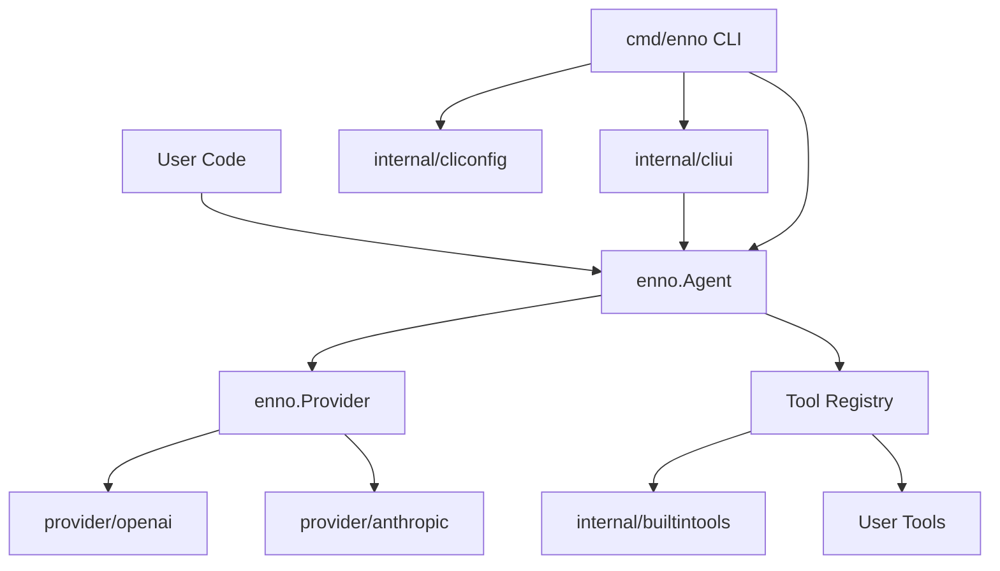

# Enno Agent Framework Design

## 目标

Enno 的目标是提供一个可被 Go 项目直接引入的通用 Agent 框架，同时交付一个可安装使用的 CLI Agent。框架核心只负责 Agent 循环、消息历史、工具调用和模型供应商抽象；具体模型 SDK、内置工具和 CLI 配置都放在独立包中。

设计重点：

- 根包 `enno` 提供稳定公共 API，不暴露 OpenAI 或 Anthropic SDK 类型。
- provider 以插件形式接入，新增模型供应商不需要改 Agent loop。
- tools 以可选包形式组合，用户可以只使用框架核心，也可以引入内置文件、shell、任务图等工具。
- CLI 复用库能力，只负责读取参数、组装 provider/tools、启动内部 UI 或执行一次 `Agent.Run`。

## 目录结构

```text
enno/
  agent.go
  config.go
  errors.go
  hooks.go
  message.go
  policy.go
  provider_iface.go
  request_options.go
  run_result.go
  schema.go
  session.go
  stream.go
  tool.go

  provider/
    provider.go
    openai/
      openai.go
    anthropic/
      anthropic.go
    internal/
      httpproxy/
        client.go

  sdk/
    sdk.go

  internal/builtintools/
    taskgraph/
    filesystem/
    shell/
    grep/
    glob/
    fetchurl/
    subagent/
    loadskill/
    compact/

  internal/
    systemprompt/
      systemprompt.go
    cliprompt/
      cliprompt.go
      env.go
      git.go
    projectrules/
      projectrules.go
    cliconfig/
      config.go
    cliui/
      repl.go
    history/
      history.go

  cmd/
    enno/
      main.go

  examples/
```

## 核心包职责

### 根包 `enno`

根包是用户最常接触的 API 面：

- `Agent`：执行 Agent loop、分发工具调用，并通过互斥锁串行化同一实例上的运行。
- `Session` / `RunResult`：显式对话状态和包含 usage、轮次、工具结果、停止原因的详细运行结果。
- `Config`：注入 provider、system prompt、tools、最大工具轮数、请求选项、hooks、policies 和 compaction。
- `Provider`：模型供应商统一接口。
- `Request` / `Response` / `RequestOptions`：Agent 与 provider 之间的统一协议和 provider-neutral 模型调用选项。
- `Message` / `ToolCall`：跨 provider 的统一消息和工具调用结构。
- `Tool` / `ToolResult`：工具声明、本地执行 handler、结构化工具结果和元数据的统一表示。
- `Hook` / `Policy`：运行时控制点，可在 provider 调用、工具调用和 Agent loop 阶段修改或中止执行。

根包不读取环境变量，也不导入具体 provider SDK。这样它可以在服务端、测试、嵌入式场景中稳定复用。

Agent 支持可选事件回调，用于观察模型调用、工具调用、工具结果和 token usage。事件只包含可观测执行过程和模型显式返回内容，不包含隐藏 chain-of-thought。

### `provider/*`

provider 子包负责把 `enno.Request` 翻译成具体模型 SDK 请求，并把响应翻译回 `enno.Response`。

- `provider/openai`：OpenAI Chat Completions 兼容实现，支持 OpenAI 兼容网关。
- `provider/anthropic`：Anthropic Messages API 实现，支持 `tool_use` 和 `tool_result`。
- `provider/provider.go`：提供 `enno.Provider` 等类型别名，方便用户按 provider 目录理解接口。

新增 provider 时，应实现：

```go
type Provider struct {
    // SDK client and config
}

func (p *Provider) Complete(ctx context.Context, req enno.Request) (enno.Response, error)
```

如需流式输出，provider 可以额外实现：

```go
func (p *Provider) Stream(ctx context.Context, req enno.Request) (enno.Stream, error)
```

未实现 `StreamProvider` 的 provider 仍可正常使用；`Agent.RunStream` 会回退到 `Complete` 并把完整响应转换为流事件。

### `sdk` 与 `internal/builtintools/*`

内置工具实现位于 `internal/builtintools/*`，不作为公共 SDK 包暴露。SDK 用户通过 `sdk.Config.BuiltinTools` 启用、禁用和配置内置工具：

- `TaskGraph`：注册 **`task_create` / `task_update` / `task_list` / `task_get`**。CLI 将任务 JSON 放在 **`~/.enno/tasks/<session_id>/`**。
- `Filesystem`：注册 `read_file`，并按配置控制 `write_file` / `edit_file`。
- `Shell`：注册 `bash`，受工作目录、超时、输出上限和 safety policy 约束。
- `Grep` / `Glob`：通过系统 `rg` 做内容搜索和文件名匹配。
- `FetchURL`：注册 `fetch_url`，读取 HTTP/HTTPS URL 并将 HTML 转成可读 markdown。
- `Subagent`：注册 **`subagent`**，用干净上下文运行子 Agent，且不会递归包含自身。
- `LoadSkill`：加载 `SKILL.md` 目录并注册 **`load_skill`**。
- `Compact` / `Compaction`：注册 `compact` 并由根包 compaction policy 执行压缩。

`sdk.ToolPermissions` 在 hook 层执行 `allowed_tools` / `disallowed_tools`，用于限制已注册工具的实际执行；`DisallowedTools` 优先于 `AllowedTools`。自定义工具仍通过根包 `enno.Tool` / `NewTool` / `NewStructuredTool` 扩展。

### `internal/cliui`

`internal/cliui` 是 CLI 专用的终端 UI 层，负责 `cmd/enno` 基于 **bubbletea**（及 bubbles viewport、lipgloss）的交互式 TUI 和非终端 fallback。它消费 Agent 事件来展示运行状态、工具轨迹和上下文使用情况。

它不是公共 SDK API。SDK 用户应直接调用 `Agent.Run` / `RunStream` 等核心 API，并在自己的 HTTP、Bot、桌面端或终端应用中自行组织交互层。

### `cmd/enno`

CLI 是正式交付物，但保持薄封装：

- 读取 CLI flags 和 `config.yaml`。
- 构造 provider。
- 注册默认工具。
- 创建并持有显式 `Session`。
- `run` 模式调用 `Agent.Run` 并输出 `RunResult.Content`。
- 交互模式调用 `internal/cliui`，同样基于显式 `Session` 连续执行 `Run`。

CLI 专用配置逻辑放在 `internal/cliconfig`，避免污染库包。

### CLI System Prompt 组装

CLI 的默认 system prompt 由 `internal/cliprompt.NewCodingAgent` 以命名 section 组装，而不是在配置解析中直接拼接长字符串。通用 SDK 不定义默认 agent identity；应用层可以通过 `sdk.Config.SystemPrompt` 和 `sdk.Config.SystemPromptSections` 自行声明 Identity、Rules、Domain Context 或 Output Style。CLI 作为一个 coding agent 应用，会在 CLI 层显式传入自己的 `Identity` section。

当前 CLI 主要 section 包括：

- `Identity`：Agent 身份和当前工作目录。
- `System`：渲染格式、系统提醒处理和可选 compaction 上下文。
- `Doing Tasks`：软件工程任务执行方式、读代码再修改、重试策略、范围控制和验证要求。
- `Safety`：URL、权限拒绝、prompt injection、代码安全和危险操作确认。
- `Environment`：当前日期、平台、shell、工作目录和是否位于 git 仓库。
- `Git Snapshot`：会话开始时的分支、默认分支、短状态和最近提交；这是 best-effort 快照，不会在会话中自动刷新。
- `Project Instructions`：从 `--workdir` 开始向上加载项目规则；同一目录优先使用 `AGENTS.md`，缺失时回退到 `CLAUDE.md`，按「更外层目录在前、更近目录在后」保留优先级，并做去重和长度预算。
- `Communication`：简洁输出、必要状态更新、文件行号引用和 GitHub issue / PR 引用格式。
- `Skills`：由 `sdk.BuiltinTools.LoadSkill` 在装配时追加技能摘要。

`internal/cliconfig` 只负责读取 YAML / flags、构造 provider 与工具配置，再把工作目录、项目规则和上下文信息交给 `internal/cliprompt`。`internal/projectrules` 只加载规则文件并返回数据，不依赖 prompt 渲染类型。根包 `enno`、`sdk` 与 provider 包不读取这些 CLI prompt 上下文。

具体工具使用建议应写在对应 `enno.Tool.Description` 中，而不是写入全局 system prompt，避免与 provider 看到的工具定义重复或冲突。

SDK 只使用 `internal/systemprompt.RuntimeSections` 追加通用运行时能力说明，不注入 CLI/coding-agent section。SDK 拼接顺序保持稳定：先输出 `SystemPrompt`，再按调用方给定顺序输出 `SystemPromptSections`，最后追加 SDK 自动生成的能力 section（例如 `Skills`）。空 section 会被跳过。

`internal/systemprompt` 与 `internal/cliprompt` 有意保持分离：前者是 SDK 内部 runtime prompt formatter，后者是 CLI 应用的 coding-agent prompt builder，且不依赖 SDK 的 internal prompt 包。这样 CLI 未来拆到独立仓库时，可以迁移 `cliprompt`、`cliconfig`、`cliui` 等 CLI 层代码，而不把 SDK runtime prompt 细节一起带走。

## 数据流



## Agent Loop

`Agent.Run(ctx, session, input)` 是基础入口，返回 `RunResult`；`RunStream(ctx, session, input, handler)` 在 provider 支持时消费流式响应。基础流程如下：

1. 将用户输入追加到调用方传入的显式 `Session`。
2. 执行 `BeforeModel` policies，例如 compaction。
3. 组装 `Request`，合并 `Config.Options`，再执行 provider hooks。
4. 调用 `Provider.Complete` 或 `StreamProvider.Stream`，传入 system prompt、历史、工具定义和请求选项。
5. 如果 provider 返回普通文本，追加 assistant message 并返回 `RunResult`。
6. 如果 provider 返回 tool calls，执行 `BeforeToolCall` / `AfterToolCall` hooks，逐个查找本地工具并执行。
7. 将工具结果追加为 tool message，执行 `AfterTools` policies，继续下一轮模型调用。
8. 若 `Config.MaxToolRounds` 为正整数且本轮已超过该上限，返回错误以防失控循环；**为零或未设置（默认）则不限制轮数**，与 Claude Code 主会话在未设置 `maxTurns` 时的行为一致。

Agent loop 暴露轻量 policies：`BeforeModel`、`AfterModel` 和 `AfterTools`。`Config.Policies` 可以添加应用侧行为，不需要 fork 核心 loop。`Config.Hooks` 更靠近 provider/tool 调用，可替换 request、response、tool call、tool result，或拒绝/中止执行。

仅当 `Config.Tools` 中注册了任一 **`task_create`、`task_update`、`task_list` 或 `task_get`** 时，`Agent` 才会安装默认 task reminder policy，在多轮工具执行后跟踪「距离上次使用任务图工具的轮数」：连续 **3** 轮模型回合里都执行了工具但未调用上述任一工具时，会在历史中追加 `<reminder>Update your task plan.</reminder>`。未挂载任务图工具时不会注入该提醒。

`Agent` 内部持有互斥锁，同一个实例的 `Run` 调用会串行执行。需要并发会话时，应创建多个 `Agent` 实例。

### 上下文压缩（Compaction）

可选 `Config.Compaction`（`nil` 或 `Enabled: false` 为关闭）。**作为库使用时**：未配置即关闭，且根包不会自行选择 `~/.enno` 等 CLI 品牌目录；应用若要保存 transcript，需要显式设置 `TranscriptDir`。**CLI** 首次生成的 `~/.enno/config.yaml` 模板中默认带有 `compaction.enabled: true` 和 `transcript_dir: ~/.enno/transcripts`（可随时改为 `false`）。启用时会安装默认 compaction policy，在每一轮模型调用**之前**对 `[]Message` 做处理：

1. **Micro**：将较早的 `RoleTool` 长内容替换为 `[Previous: used <tool>]` 占位，保留最近 N 条**符合条件**的 tool 结果全文；工具名由向前扫描最近一条 `RoleAssistant` 的 `ToolCalls` 匹配 `ToolCallID`。若配置了 `MicroCompactToolNames`（非空），仅对这些工具名的 tool 消息参与「保留最近 N 条 / 更早占位」；其它工具结果始终保留全文。
2. **Auto**：用「字符估算的 `EstimateUsage`」与「上一轮 `Complete` 返回的 `Usage.InputTokens`（若有）」取较大值，作为保守输入规模；与**有效阈值**比较。阈值优先级：`ModelContextTokens > 0` 时用 `ModelContextTokens - AutoCompactBufferTokens`（buffer 默认 13000）；否则用 `AutoCompactInputTokens`（默认 50000）。达到阈值则把当前历史写入 `TranscriptDir` 下的 `transcript_<unix>.jsonl`，再调用模型摘要；摘要提示要求 `<analysis>` + `<summary>`，`FormatCompactSummary` 会去掉 analysis 并抽取 summary。摘要失败时可配置「仅自动路径」`SkipOnSummarizeError`：发错误事件但不替换历史；并支持一次「仅用后半段消息」的重试。同一 `Run()` 内连续摘要失败达到上限则本趟不再尝试自动压缩。
3. **Manual**：模型在同一条 assistant 消息中**仅**调用 `compact` 工具时，弹出该条 assistant，对「弹出前的历史 + 被弹出的 assistant」做与 Auto 相同的存档与摘要；摘要失败时仍**中止并返回错误**（与自动路径的 skip 策略无关）。成功后同样收起为单条 `[Compressed]` 用户消息；**不**为本次 compact 追加 `ToolMessage`。

手动与自动路径都会**额外计费**；配置 `TranscriptDir` 时会在磁盘写入 transcript。实现放在根包 `compaction_impl.go`（避免与根包导入循环）。

### Subagent（`subagent` 工具）

通过 `sdk.BuiltinTools.Subagent` 启用名为 `subagent` 的工具：父 `Agent` 在持有完整工具列表（含 `subagent`）的前提下，每次调用 `subagent` 会**新建**一个子 `Agent`，子 Agent 使用**空历史**、子专用 system prompt、继承的工具权限，以及**不含 `subagent` 的工具集**（与父共享同一 `Provider`）。子 Agent 跑完 `Agent.Run` 后，仅将其最终文本回复（经长度截断）作为本次 `subagent` 的工具结果写回父对话；子会话中的中间消息全部丢弃，从而实现与父上下文的隔离。子工具列表中若再次包含 `subagent` 会在构造时报错，避免递归委派。

CLI 默认不启用该工具；在 `config.yaml` 中设置 `subagent: true` 或使用相应逻辑开启后，才会装配。

### Skills（`load_skill` 与 `SKILL.md`）

通过 `sdk.BuiltinTools.LoadSkill` 配置的目录会被**递归**查找 `SKILL.md`：每个文件使用 YAML frontmatter（`name`、`description`）与正文；`name` 缺省时用该文件**所在目录名**。

- **第一层（低成本）**：在命名 `Skills` system prompt section 中追加 `Skills available:` 与每行 `  - name: description` 摘要。
- **第二层（按需）**：`load_skill` 工具接受参数 `name`，在 **tool result** 中返回 `<skill name="...">` 包裹的完整正文；未知名称则返回 `Error: Unknown skill '...'.` 风格提示。

若目录中未找到任何可解析的 skill，不注册 `load_skill`，也不追加摘要。子 Agent（若启用 `subagent`）会获得与父级相同的 `load_skill` 工具与技能目录扫描结果。磁盘读取与解析仅发生在 CLI / 应用装配侧，不进入根 `enno` 包。

CLI 会**默认**把 `~/.enno/skills` 作为第一个技能根目录（不存在则跳过），再通过 `config.yaml` 的 `skills_extra_dirs` 与（可选）`skills_dir`、以及 `--skills-dir` **按顺序合并**；多个目录下出现同名 skill 时，**后序目录覆盖先序**。

## 扩展点

### 自定义工具

使用 `enno.NewTool` 可以直接接收原始 JSON 参数；使用 `enno.NewTypedTool[T]` 可以让框架完成 JSON 解析：

```go
type Input struct {
    Name string `json:"name"`
}

tool := enno.NewTypedTool("greet", "Greet a person.", schema, []string{"name"},
    func(ctx context.Context, input Input) (string, error) {
        return "Hello, " + input.Name, nil
    },
)
```

### 自定义 Provider

只要实现 `enno.Provider` 即可接入任意模型后端：

```go
type MyProvider struct{}

func (p *MyProvider) Complete(ctx context.Context, req enno.Request) (enno.Response, error) {
    // Convert req to your model API, then return enno.Response.
}
```

## 设计约束

- 根包不得导入具体模型 SDK。
- CLI 不得实现独立 Agent loop。
- 内置工具不得依赖全局状态。
- 文件和 shell 工具必须显式配置工作目录或根目录。
- provider adapter 只做协议转换，不执行本地工具。
